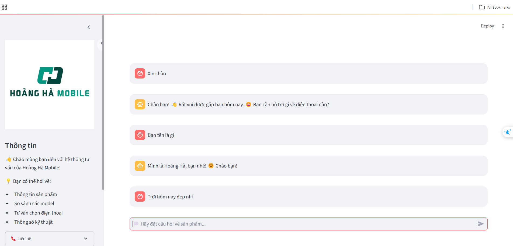
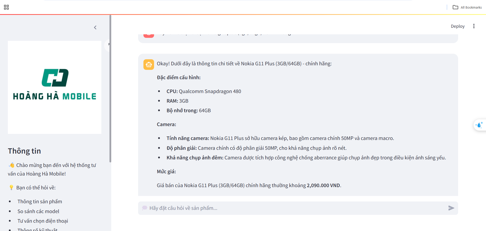
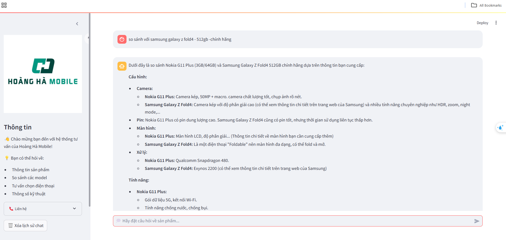
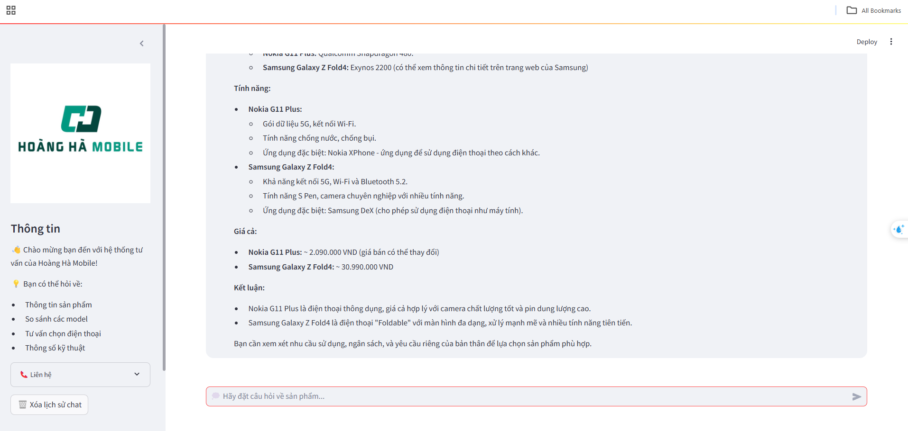

# Chatbot Tư Vấn Điện Thoại - Hoàng Hà Mobile 📱

Chatbot tư vấn thông minh sử dụng RAG (Retrieval Augmented Generation) để tư vấn sản phẩm điện thoại, tích hợp với cơ sở dữ liệu MongoDB và mô hình ngôn ngữ Gemma.

## 📸 Demo Screenshots

### Giao diện chính

*Giao diện chính của chatbot với sidebar thông tin và khung chat*

### Tư vấn sản phẩm

*Chatbot đang tư vấn chi tiết về một mẫu điện thoại*

### So sánh sản phẩm


*So sánh thông số kỹ thuật giữa các mẫu điện thoại*

### Trò chuyện thông thường

*Chatbot có thể trò chuyện tự nhiên với người dùng*

### Tính năng tìm kiếm
### Sau khi nhận yêu cầu từ người dùng hệ thống sẽ reflection và tăng cường prompt như sau và truyền vào model :
Query_user: hãy nói về samsung galaxy z fold4 - 256gb - chính hãng
Context: Bạn có thể cho mình biết thêm chi tiết về Samsung Galaxy Z Fold4 với dung lượng lưu trữ 256GB, đặc biệt là về n
hững ưu điểm và nhược điểm của phiên bản này? Còn nữa, bạn có thể cung cấp thông tin về mức giá, nơi bán chính hãng và các màu sắc khác cho phiên bản này không?
Thông tin sản phẩm:
 1) Tên: samsung galaxy z fold4 - 256gb - chính hãng, Giá: nan, Thông số: Công nghệ màn hình:
Dynamic AMOLED 2X<br> Độ phân giải:
Chính: QXGA+ (2176 x 1812 Pixels) & Phụ: HD+ (2316 x 904 Pixels), Chính 50 MP & Phụ 12 MP, 10 MP, 10 MP & 4 MP<br> Kích thước màn hình: 
Chính 7.6 inch & 6.2 inch<br> Hệ điều hành:
Android 12<br> Vi xử lý:
Snapdragon 8+ Gen 1 8 nhân<br> Bộ nhớ trong:
256 GB<br> RAM:
12GB<br> Mạng di động:
Hỗ trợ 5G<br> Số khe SIM:
1 Nano SIM & 1 eSIM<br> Dung lượng pin:
4400 mAh<br>, Ưu đãi: nan, Màu sắc: []
 2) Tên: samsung galaxy z fold4 - 512gb -chính hãng, Giá: nan, Thông số: Công nghệ màn hình:
Dynamic AMOLED 2X<br> Độ phân giải:
Chính: QXGA+ (2176 x 1812 Pixels) & Phụ: HD+ (2316 x 904 Pixels), Chính 50 MP & Phụ 12 MP, 10 MP, 10 MP & 4 MP<br> Kích thước màn hình: 
Chính 7.6 inch & 6.2 inch<br> Hệ điều hành:
Android 12<br> Vi xử lý:
Snapdragon 8+ Gen 1 8 nhân<br> Bộ nhớ trong:
512GB<br> RAM:
12GB<br> Mạng di động:
Hỗ trợ 5G<br> Số khe SIM:
1 Nano SIM & 1 eSIM<br> Dung lượng pin:
4400 mAh<br>, Ưu đãi: nan, Màu sắc: []
                Yêu cầu: Hãy trả lời câu hỏi của người dùng dựa trên context và
                thông tin sản phẩm được cung cấp. Nếu không có sản phẩm cụ thể được yêu cầu,
                hãy gợi ý các sản phẩm phù hợp dựa trên nhu cầu được thể hiện trong context.

## 🌟 Tính năng chính

- Tư vấn sản phẩm điện thoại dựa trên dữ liệu thực
- Phân loại câu hỏi thông minh (sản phẩm/trò chuyện)
- Tìm kiếm vector với MongoDB
- Giao diện người dùng thân thiện với Streamlit
- Xử lý ngữ cảnh thông minh với reflection

## 🛠 Công nghệ sử dụng

- **Python 3.8+**
- **Streamlit**: UI Framework
- **MongoDB**: Vector Database
- **LangChain**: Framework xử lý LLM
- **Gemma**: Mô hình ngôn ngữ
- **Sentence Transformers**: Mô hình embedding

## 📋 Yêu cầu hệ thống

- Python 3.8 trở lên
- MongoDB 7.0+ với Atlas Vector Search
- GPU (khuyến nghị) hoặc CPU mạnh
- Tối thiểu 8GB RAM

## 🚀 Hướng dẫn cài đặt

1. Clone repository:
```bash
git clone https://github.com/HaiSon7/Chatbot-with-RAG
```

2. Tạo môi trường ảo:
```bash
python -m venv venv
source venv/bin/activate  # Linux/Mac
.\venv\Scripts\activate   # Windows
```

3. Cài đặt dependencies:
```bash
pip install -r requirements.txt
```

4. Cấu hình MongoDB:
- Tạo tài khoản MongoDB Atlas
- Tạo database và collection
- Tạo vector index cho collection
- Cập nhật connection string trong `.env`

5. Cấu hình biến môi trường:
```bash
cp .env.example .env
# Cập nhật các biến trong .env
```

## 💻 Cấu trúc dự án

```
chatbot-hoanghamobile/
├── embeddings/           # Xử lý embedding
├── rag/                  # Logic RAG
├── reflection/          # Xử lý ngữ cảnh
├── semantic_router/     # Phân loại câu hỏi
├── main.py              # Entry point
├── requirements.txt     # Dependencies
└── README.md
```

## 🎯 Sử dụng

1. Khởi động ứng dụng:
```bash
streamlit run main.py
```

2. Truy cập ứng dụng tại:
```
http://localhost:8501
```

## 📝 API Reference

### RAG Class
```python
rag = RAG(embedding, mongodbUri, dbName, dbCollection)
rag.vector_search(query, limit=2)
rag.enhance_prompt(query, limit=2)
```

### SemanticRouter Class
```python
router = SemanticRouter(embedding)
router.guide(query)  # Returns: 0 (product) or 1 (chitchat)
```

### Reflection Class
```python
reflection = Reflection(llm)
reflection.summarize_context(history, query)
reflection(history, query)
```

## 🔧 Cấu hình

Các thông số có thể điều chỉnh trong `config.py`:

```python
MODEL_NAME = "gemma2:2b"
MODEL_TEMP = 0.5
EMBEDDING_MODEL = 'keepitreal/vietnamese-sbert'
DB_NAME = "products"
DB_COLLECTION = "products"
```

## 🤝 Đóng góp

1. Fork repository
2. Tạo branch mới (`git checkout -b feature/AmazingFeature`)
3. Commit thay đổi (`git commit -m 'Add some AmazingFeature'`)
4. Push to branch (`git push origin feature/AmazingFeature`)
5. Tạo Pull Request

## 📄 License

MIT License - xem [LICENSE](LICENSE) để biết thêm chi tiết

## 👥 Tác giả

- **Your Name** - *Initial work* - [YourGithub](https://github.com/yourusername)

## 🙏 Acknowledgments

- Gemma team cho mô hình ngôn ngữ
- Sentence Transformers cho mô hình embedding
- MongoDB team cho Atlas Vector Search
- Streamlit team cho framework UI

## 📊 Roadmap

- [ ] Thêm support nhiều ngôn ngữ
- [ ] Cải thiện độ chính xác của vector search
- [ ] Tối ưu hóa performance
- [ ] Thêm tính năng analytics
- [ ] Tích hợp với các nguồn dữ liệu khác

## ❓ FAQ

**Q: Làm sao để thêm sản phẩm mới?**
A: Thêm dữ liệu vào MongoDB collection và chạy script cập nhật embedding.

**Q: Mô hình có hoạt động offline không?**
A: Có, nhưng cần tải về mô hình Gemma và cấu hình phù hợp.

**Q: Làm sao để thay đổi mô hình ngôn ngữ?**
A: Cập nhật `MODEL_NAME` trong config và đảm bảo mô hình tương thích với LangChain.

## 🔗 Links hữu ích

- [MongoDB Atlas Documentation](https://docs.atlas.mongodb.com/)
- [Streamlit Documentation](https://docs.streamlit.io/)
- [LangChain Documentation](https://python.langchain.com/docs/)
- [Sentence Transformers Documentation](https://www.sbert.net/)